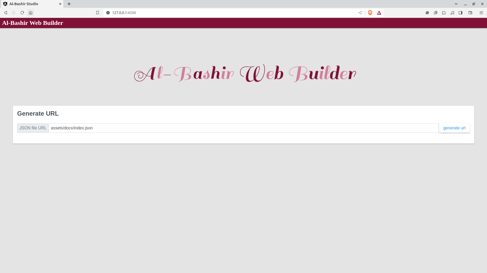
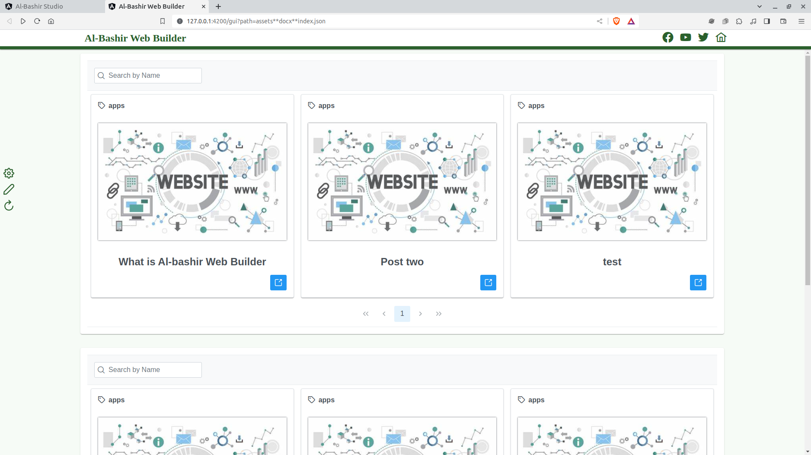
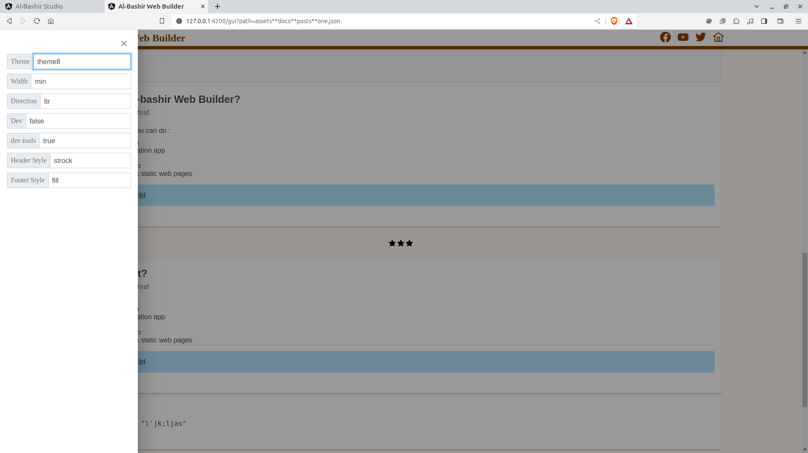
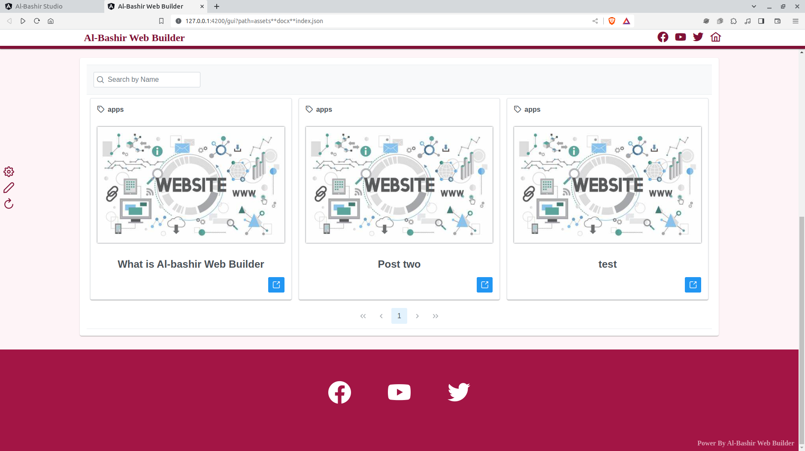
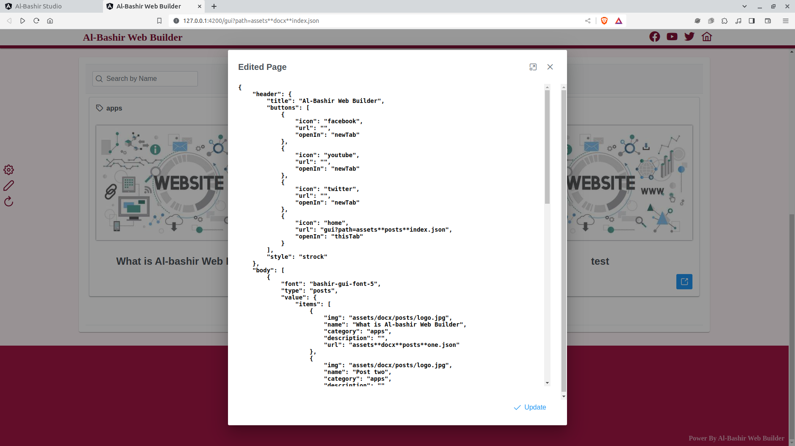

# Al-Bashir Web Builder
This is a web app built using Angular to generate static web site using json file.

## Demo
https://al-bashir-web-builder.vercel.app/


## Screenshots







---

## Features

- Edited json Fiel at runtime
- change theme and other setting in runtime
- have a lot of componets 
- navigtaion to anther page
- customize header and footer
- generate url for your file


## Requirements
- Node.js v16 or higher
- Angular CLI

## Installation
-  Clone this repository:

```bash
  git clone https://github.com/mahmoudashraf-code/Al-BashirWebBuilder.git
  cd Al-BashirWebBuilder
```
- Install dependencies:

```bash
  npm i
```


## Install using Docker Image
```bash
  docker pull mahmoudashraf2000/lawyer-assistant
```


## Usage
-  Start the server:
```bash
  cd server
  npm run start
```

-  Start frontend:

```bash
  npm run start
```

- Open a web browser and go to http://localhost:4200


## Security
This app does not store any of your personal information. All communication between the client and server is encrypted over HTTPS.


## Troubleshooting
If you are having any problems with this app, please open an issue on GitHub.


## License
This app is licensed under the [MIT](https://choosealicense.com/licenses/mit/) License.

